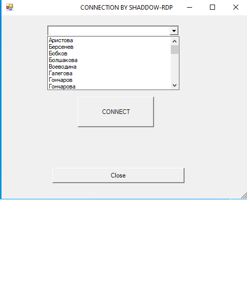

                      ~~~~~~~~~~~~~~~~~~~~~~~~~~~~~~~~~~~~~~~~~~~~~~~~~~~~~~~~~~~~~~~~~~~~~~~~~~~~~~~~
                      Краткое объяснение работы и назначений данных скриптов написанных на powershell:
                      ~~~~~~~~~~~~~~~~~~~~~~~~~~~~~~~~~~~~~~~~~~~~~~~~~~~~~~~~~~~~~~~~~~~~~~~~~~~~~~~~

1) "Comps Info"
На локальном диске компьютера, содержится список всех компьютеров и нотбуков организации (hostname).
Скрипт пробегается по всем компьютерам, для тех кто в AD одна часть кода, кто не в AD схожая ей, только добавляется авторизация 
локального админа.Собирает с каждого ПК необходимую инф.(имя пользователя, его ip адрес, основные характеристики железа).
Результат заносится в .csv файл. В результате получаем актуальную информацию, какой сотрудник за каким рабочим местом сидит.
Таким образом нет необходимости отслеживать передвижения сотрудников и компьютеров, кто за каким робочем местом работает.

2) "Connected by PS(Form)"
Создаётся объект типа Windows.Forms.Form, в котором есть выпадающий список пользователей сети. При нажатии на кнопку Connect
происходит интерактивное соединение через powershell. Таким образом можно подлкючиться к любому пользователю, находящемуся в
сети, выбрав его из списка.

3) "User-Hostname"
Список для "Connected by PS" получается, благодоря скрипту User-Hostname.
Который в свою очередь собирает информацию о пользователях и их hostname-ов, занося всё в хэш-таблицу, которая экспортируется
в файл "Users-Hostname.cli".

4) "VNC-Connect" 
Создаётся объект типа Windows.Forms.Form, в котором есть выпадающий список пользователей сети. При нажатии на кнопку Connect
происходит подключение с автоматическим подставлением пароля к пользователям. Удобное подключение через Ultra VNC. После окончания сессии,
пользователю приходит сообщение- "Продолжайте работать!"

5)"Get-UserIP"
Этот скрипт получает информацию о пользователях и их ip адресов, занося всё в хэш-таблицу, которая экспортируется
в файл "hash.cli". Этот файл используется в дальнейшем для подключения по VNC.

6)"Shadow-connect"
Создаётся объект типа Windows.Forms.Form, в котором есть выпадающий список пользователей AD.Который поучается из файла "hash2.cli",
формируемого скриптом "Shaddow-table".При нажатии на  кнопку "Connect" подключаемся к пользователю через теневое соединение с заданными параметрами.

